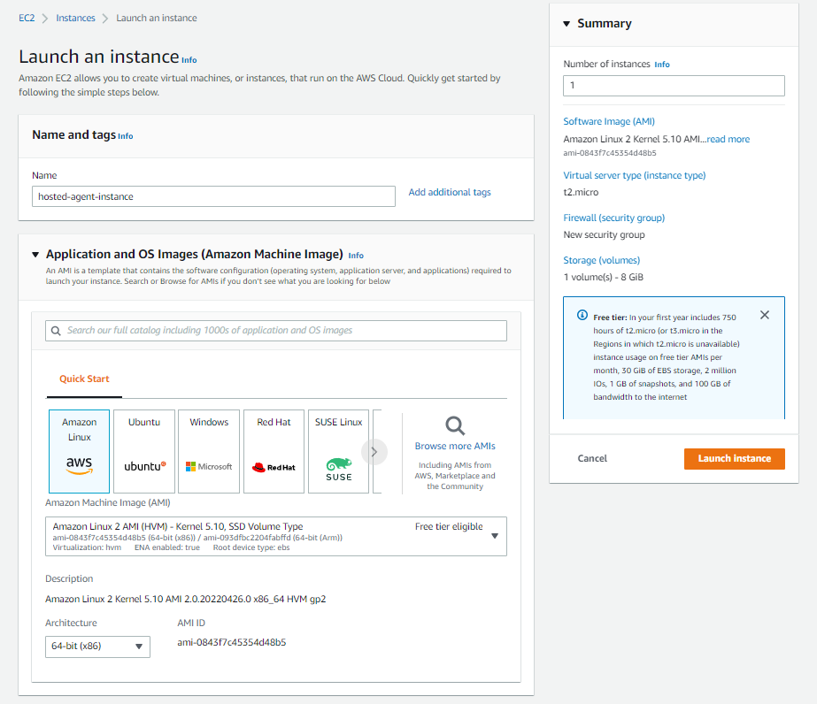
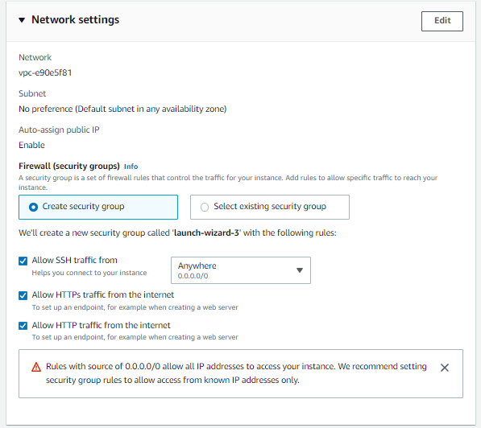
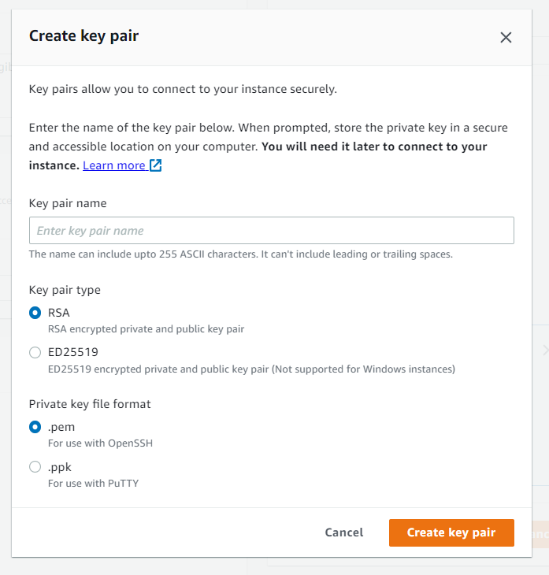
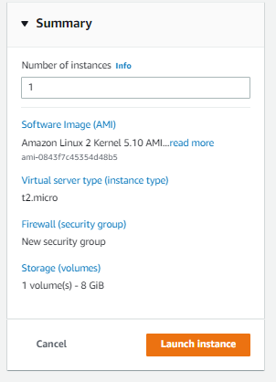
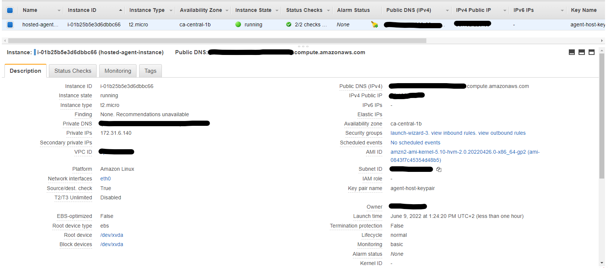

# Simple Host Setup - AWS EC2

## Introduction

Setting up a small linux host in the cloud is our recommended approach to getting your agent going. This because the cloud provider also provides for all the additional networking requirements like public IP addresses and DNS names and TLS certificates.

## Setup Procedure

### Create EC2 Instance

It is relatively simple to create an usable EC2 instance using the new EC2 Launch Wizard.
We will use Ubuntu 20.04 LTS as the OS and leave all the other defaults and include the following options:

Give your instance a name

Create a Login KeyPair (if you don't already have one)

Select the additional HTTPS & HTTP inbound traffic access rules

Then click Launch and wait a minute for the instance to start.


After a bit you will see the instances created and the summary of any selected instance.


### Connect to Instance

Clicking the CONNECT button at the top of the summary screen will show you a dialog of common ways to connect to your new instances command shell. You will need the Key-Pair file you created above if you choose the SSH method.

### Install Software Pre-requisites

#### Install Security Updates

As prompted during the initial shell login welcome, you should install any additional updates and security patches if prompted.

``` bash
sudo apt update
sudo apt upgrade
```

#### Install Docker and tools

Install Docker with the dev installation script. [docs](https://docs.docker.com/engine/install/ubuntu/)

``` bash
curl -fsSL https://get.docker.com -o get-docker.sh
sudo sh get-docker.sh
sudo usermod -aG docker $USER
```

At this point you need to log out and back in again (and probably also do an instance reboot)

``` bash
sudo reboot
```

Check the docker system after logging back in

``` bash
docker version
docker-compose version
```

#### Install Git

``` bash
sudo apt install git
```

### Additional Setup

The docker images provided do not come with their own TLS certificates, so it is required that you use additional AWS features like *Load Balancers* (Listeners with HTTPS) & *Target Groups* (Instance with HTTP) to configure the relevant inbound networking configuration.
You will need to cater for the following **Listener** and **Target Group** configuration.

| Component | LB Listener Config | Target Group Config<br>(Instance mode) |
| --------- | ------------------ | ---------------------------------- |
| agent | HTTPS (443) | HTTP (80) |
| demo app | HTTPS (8080) | HTTP (8080) |

Follow the rest of the setup deployment guide.