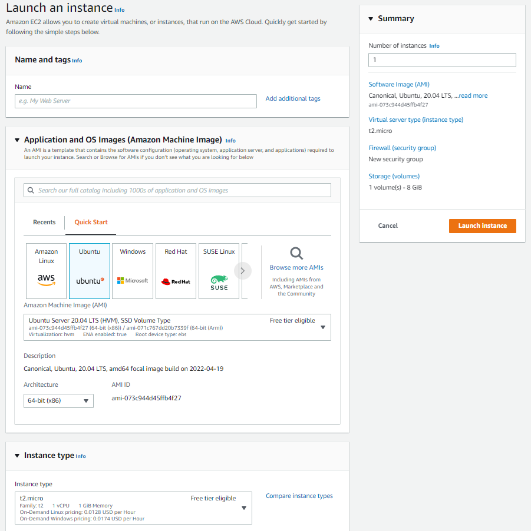

#Simple Host Setup - AWS EC2

## Introduction
<br>
## Setup Procedure

### Create EC2 Instance

It is relatively simple to create an usable EC2 instance using the new EC2 Launch Wizard.
Simply leave all the defaults and include the following options:

Give your instance a name<br>
<br>
Create a Login KeyPair (if you don't already have one)<br>
<br>
Select the additional HTTPS & HTTP inbound traffic access rules<br>
<br>
Then click Launch and wait a minute for the instance to start.<br>
<br>

After a bit you will see the instances created and the summary of any selected instance.<br>


### Connect to Instance

Clicking the CONNECT button at the top of the summary screen will show you a dialog of common ways to connect to your new instances command shell. You will need the Key-Pair file you created above if you choose the SSH method.

Once you have connected you should see the following in your terminal program.


### Install Software Pre-requisites

#### Install Security Updates

As prompted during the initial shell login welcome, you should install any additional updates and security patches if prompted.
<br>
```
sudo yum update
```

#### Install Docker tools
<br>
``` bash
sudo yum install docker
sudo curl -L https://github.com/docker/compose/releases/download/1.22.0/docker-compose-$(uname -s)-$(uname -m) -o /usr/local/bin/docker-compose
sudo chmod +x /usr/local/bin/docker-compose
docker-compose version
```

#### Install Git
<br>
```
sudo yum install git
```